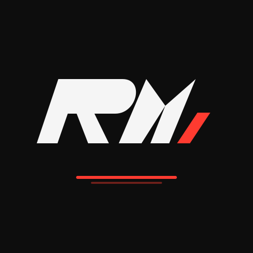

<h1 align="center">
  
  <br/>
  R.M Bike Point
</h1>

<p align="center">
  <strong>Premium Motorcycle Service, Spare Parts & Used Bikes — Kolkata</strong>
</p>

<p align="center">
  <a href="https://rm-bike-point-master.vercel.app" target="_blank">
    
  </a>
  
  
  
  
  
</p>

<p align="center">
  
</p>

---

## 🏍️ Overview

**R.M Bike Point** is a full-stack, production-grade web application for a premium motorcycle service center in Kolkata. It delivers a complete digital experience — from online service booking to a live spare parts marketplace — all wrapped in a KTM/Tesla-inspired premium dark UI.

> **Live at:** [https://rm-bike-point-master.vercel.app](https://rm-bike-point-master.vercel.app)

---

## ✨ Features

### 🛒 Spare Parts Marketplace
- Browse genuine motorcycle spare parts by **brand, model, category**
- Dynamic stock status: **In Stock / Low Stock / Out of Stock**
- **Add to Cart** with quantity management & persistent cart (localStorage)
- **Wishlist** system with heart toggle
- Product detail pages with compatibility info, warranty, delivery & returns
- Review & rating system per product

### 📅 Service Booking
- Multi-step booking form with **bike model, service type, date & time**
- Saves booking data to **Supabase PostgreSQL** database
- Booking confirmation with reference ID

### 🔐 Authentication
- **Clerk** authentication (Google, Email, Phone)
- Protected routes for profile and booking
- Admin panel access control by email

### 👤 Rider Profile
- Dashboard with booking history, loyalty points, stats
- Profile editing (name, phone, address)
- Order tracking & service reminders

### 🤖 AI Chatbot
- Floating chat widget powered by AI API
- Session persistence across page refreshes (localStorage)
- Multi-session chat history

### 🏪 Admin Panel
- Inventory management (Add / Edit / Delete listings)
- Bike listings management
- Customer queries management
- Order tracking dashboard
- Blog post management

### 📖 Blog
- Rich motorcycle articles & guides
- Admin can create/edit/delete posts with cover images
- Social share buttons (WhatsApp, Twitter, Facebook)

### 📱 Progressive Web App (PWA)
- Installable on Android, iOS, Chrome, Samsung Internet
- Adaptive icons with 20% safe zone padding
- Offline caching via Service Worker
- Splash screen with RM brand animation

---

## 🎨 Design System

| Token | Value |
|-------|-------|
| Primary Background | `#0D0D0D` — Matte Black |
| Brand Accent | `#FF3B30` — Racing Red |
| Text Primary | `#F5F5F5` — Pure White |
| Text Secondary | `#A3A3A3` — Muted Gray |
| Glass Surface | `rgba(255,255,255,0.04)` |
| Border | `rgba(255,255,255,0.08)` |

**Typography:** Inter (primary), Arial Black (monogram)  
**Animations:** Framer Motion — path drawing, metallic sweeps, micro-interactions

---

## 🏗️ Tech Stack

| Layer | Technology |
|-------|-----------|
| **Frontend** | React 18 + TypeScript + Vite 6 |
| **Styling** | Tailwind CSS v3 + Custom CSS |
| **Animations** | Framer Motion / motion/react |
| **Auth** | Clerk (Google, Email, Phone OTP) |
| **Database** | Supabase (PostgreSQL) |
| **State** | Zustand (cart, wishlist, UI) |
| **Routing** | React Router v6 |
| **Hosting** | Vercel (production) |
| **PWA** | Vite PWA Plugin + Service Worker |
| **Icons** | Lucide React |
| **Notifications** | React Hot Toast |
| **PDF** | jsPDF (invoice generation) |

---

## 📁 Project Structure

```
rm-bike-point/
├── public/
│   ├── rm-brand-logo.svg        # Full horizontal brand logo
│   ├── rm-app-icon.svg          # Square app icon (PWA)
│   ├── rm-monogram.svg          # RM monogram only
│   ├── icon-192.png             # PWA icon 192×192
│   ├── icon-512.png             # PWA icon 512×512
│   ├── maskable-icon.png        # Android adaptive icon
│   ├── apple-touch-icon.png     # iOS home screen icon
│   ├── service-*.jpg            # Service section images
│   ├── footer-*.jpg             # Footer gallery images
│   └── manifest.json
│
├── src/
│   ├── components/
│   │   ├── navigation/          # Navbar, Drawer, ProfileDropdown
│   │   ├── profile/             # Dashboard, Stats, QuickActions
│   │   ├── blog/                # BlogSection, CreatePost
│   │   ├── Admin*.tsx           # Admin panel panels
│   │   ├── ChatWidget.tsx       # AI chat with session persistence
│   │   ├── SplashScreen.tsx     # Brand animation (SVG path draw)
│   │   ├── Footer.tsx
│   │   └── Navbar.tsx
│   │
│   ├── pages/
│   │   ├── Home.tsx             # Landing page
│   │   ├── Shop.tsx             # Spare parts marketplace
│   │   ├── ProductDetail.tsx    # Product page
│   │   ├── Services.tsx         # Service menu
│   │   ├── Booking.tsx          # Service booking form
│   │   ├── Bikes.tsx            # Used bikes listing
│   │   ├── Profile.tsx          # Rider dashboard
│   │   ├── Admin.tsx            # Admin panel
│   │   ├── Blog.tsx / BlogPost.tsx
│   │   └── Cart.tsx / Wishlist.tsx
│   │
│   ├── lib/
│   │   ├── firebase.ts          # Supabase adapter (Firebase-like API)
│   │   └── supabase.ts          # Direct Supabase client
│   │
│   ├── store/
│   │   ├── useCartStore.ts      # Zustand cart (persisted)
│   │   └── useWishlistStore.ts  # Zustand wishlist (persisted)
│   │
│   ├── constants/
│   │   ├── bikeData.ts          # Bike brands, models, categories
│   │   └── servicesData.ts      # Service categories & pricing
│   │
│   └── services/
│       └── loyaltyService.ts    # Loyalty points logic
│
├── supabase/
│   └── database_schema.sql      # Complete DB schema
│
└── generate-icons.js            # PWA icon generator script
```

---

## 🚀 Getting Started

### Prerequisites
- Node.js 18+
- npm or pnpm
- Supabase account
- Clerk account

### 1. Clone the repository
```bash
git clone https://github.com/TamanashChakraborty/rm-bike-point.git
cd rm-bike-point
```

### 2. Install dependencies
```bash
npm install
```

### 3. Environment Setup
Create a `.env` file in the root:
```env
VITE_SUPABASE_URL=your_supabase_project_url
VITE_SUPABASE_ANON_KEY=your_supabase_anon_key
VITE_CLERK_PUBLISHABLE_KEY=your_clerk_publishable_key
VITE_GEMINI_API_KEY=your_gemini_api_key
```

### 4. Database Setup
Run the SQL schema in your Supabase SQL Editor:
```bash
# Open Supabase Dashboard → SQL Editor
# Paste contents of: supabase/database_schema.sql
# Click Run
```

### 5. Run locally
```bash
npm run dev
```

### 6. Generate PWA Icons
```bash
node generate-icons.js
```

---

## 🗄️ Database Schema

| Table | Purpose |
|-------|---------|
| `bookings` | Service appointment bookings |
| `products` | Spare parts inventory |
| `orders` | Customer purchase orders |
| `users` | Rider profiles |
| `chatSessions` | AI chat sessions |
| `chatSessions_messages` | Chat message history |
| `loyalty_points` | Rider reward points |

---

## 📱 PWA Installation

| Platform | Instructions |
|----------|-------------|
| **Android (Chrome)** | Tap the install banner or ⋮ → "Add to Home Screen" |
| **iOS (Safari)** | Tap Share → "Add to Home Screen" |
| **Desktop (Chrome)** | Click the ⊕ icon in the address bar |

---

## 🌐 Deployment

The app is deployed on **Vercel** with automatic CI/CD.

```bash
# Manual deploy
npx vercel --prod
```

---

## 📞 Business Info

| | |
|--|--|
| **Location** | Jhosser Road, Dighar More, Near Bamongachi Choumatha, Barasat, Kolkata 700125 |
| **Phone** | +91 62893 28280 / +91 91230 16354 |
| **Email** | rishistark009@gmail.com |
| **Hours** | Mon–Sat: 9AM–8PM · Sun: 10AM–4PM |

---

## 📄 License

This project is proprietary software owned by **R.M Bike Point**.  
All rights reserved © 2024–2025 R.M Bike Point.

---

<p align="center">
  Built with ❤️ for riders in Kolkata
  <br/>
  <a href="https://rm-bike-point-master.vercel.app">🏍️ Visit Live Site</a>
</p>
